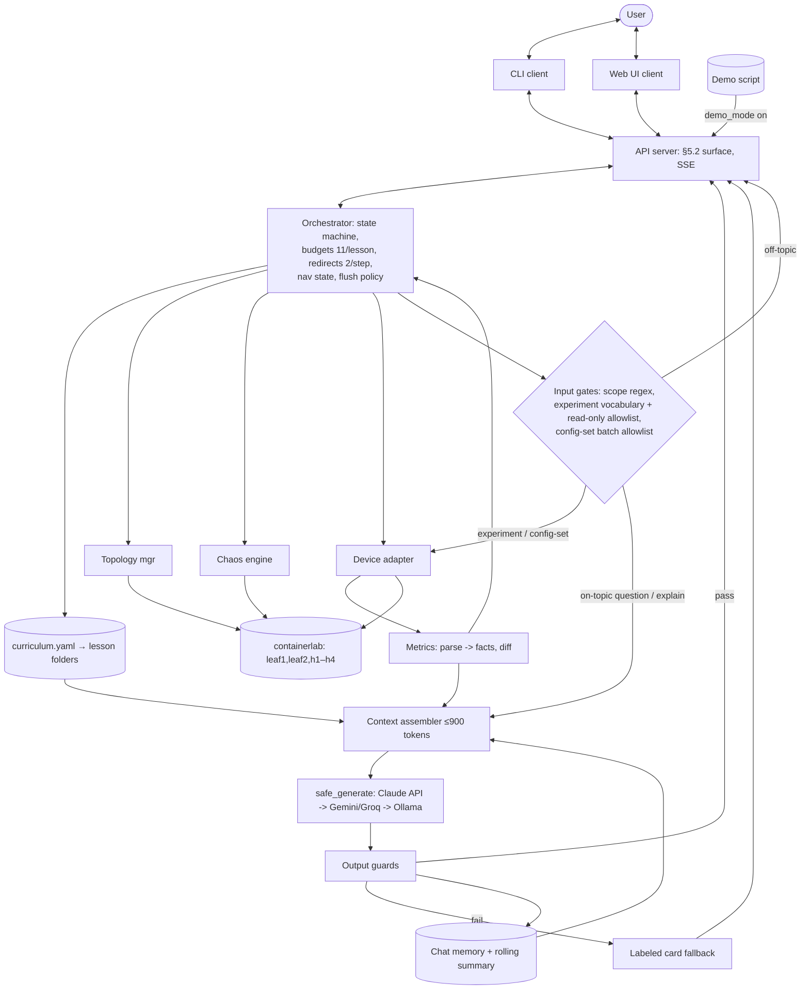

# SONiC ChaosLab — Learn Networking by Breaking It
**Product Description Document** · v1.0 · 2026-09-28 · License: Apache-2.0 · Author: solo participant, SONiC Hackathon 2026

---

## 1. Product overview

| | |
|---|---|
| **Name** | SONiC ChaosLab |
| **Tagline** | Learn networking by breaking it |
| **One-liner** | An interactive, AI-assisted CLI environment that teaches how SONiC behaves under failure: it explains a concept on a live virtual SONiC lab, injects one controlled failure, shows the real before/after state, and has an LLM explain the observed impact in plain language. |
| **Form factor** | Terminal CLI application + web UI (thin graphical layer over the same engine; CLI remains the reference interface) |
| **Event** | SONiC Hackathon 2026 (SONiC Foundation / Linux Foundation, virtual) |
| **Deliverable** | Open-source repo (Apache-2.0) + working demo covering three SONiC scenarios |
| **Team** | 3 — engine/AI/lessons (author) + UI |

### Submitted abstract (verbatim)
> SONiC ChaosLab is an interactive, AI-assisted environment for learning how SONiC behaves under failure, aimed at lowering the onboarding barrier for new SONiC contributors and operators. Built on a Containerlab sonic-vs topology, each lesson targets SONiC internals: it reads baseline state from SONiC's Redis databases (CONFIG_DB/STATE_DB) and CLI, injects one controlled failure into a SONiC component (e.g., killing the bgp container or downing an uplink), then shows the real before/after state while an LLM explains what happened in plain language. A one-click reset restores the lab. What's new for SONiC: the first chaos-driven, self-guided learning lab focused on SONiC's own architecture — containers, DB state model, and reconvergence — turning abstract behavior into repeatable experiments. It builds on existing OSS (Containerlab, Pumba/tc, a local LLM); the new work is the SONiC-specific integration, lesson content, and explain-on-observed-state engine. Deliverable: an open-source repo (Apache-2.0) with a working demo covering three SONiC scenarios.

---

## 2. Problem statement

1. Networking concepts (BGP convergence, redundancy, MTU behavior, control-vs-data plane) are hard to grasp from theory alone; failure behavior is almost never taught hands-on.
2. Newcomers to SONiC face a steep wall: its container architecture, Redis state model, and config pipeline are unfamiliar even to experienced engineers.
3. Existing tools don't close the loop: emulators (GNS3/EVE-NG/Containerlab) provide labs but no guidance; chaos tools (Pumba/Chaos Mesh) break things but don't teach; tutorials and LLM chatbots are static and unglued from real device state.

**Target users:** new SONiC contributors and operators; engineers onboarding to open networking; the author (self-study is an explicit use case).

## 3. Value proposition & differentiator

The grounded **explain → break → explain-the-impact** loop on a real network OS:
- Explanations are grounded in **actual observed device state**, not textbook recall.
- Chaos is **curated and reversible** (one failure per lesson, one-click restore) — safe to repeat.
- The lab is **SONiC-specific**: lessons teach SONiC's own containers, Redis DBs, SAI pipeline, and reconvergence, observable via `redis-cli` alongside `show` commands.
- Novel combination: emulators have no AI; chaos tools have no pedagogy; tutors have no live NOS.

---

## 4. Product principles (binding design rules)

1. **Code computes facts; the LLM only explains.** Route counts, states, diffs, timings are parsed deterministically in Python and *injected* into prompts. The LLM never counts, never decides flow, never executes anything autonomously. In experiment mode it may *propose* a command from a natural-language instruction, but execution requires explicit user confirmation and passes a code-enforced read-only allowlist.
2. **Predictability over capability.** This is a workflow, not an agent: fixed pipeline, bounded interactivity (question/redirect budgets, allowlisted experiments), every path terminates (pass / labeled fallback / redirect / budget auto-advance). CLI can never hang.
3. **Lessons are data, not code.** The engine is content-agnostic; a lesson is a YAML file. Adding lesson N+1 costs content, not engineering.
4. **Fence scope horizontally, not vertically.** Off-topic questions are redirected; on-topic questions may go as *deep* as the learner wants using the model's full knowledge (labeled "general background" when beyond vetted notes).
5. **Deploy once, reset — never rebuild.** sonic-vs boots take minutes; baseline restore is the only inter-lesson operation.
6. **Vendor-neutral, public interfaces only.** No vendor references; only public SONiC surfaces (CLI, Redis, FRR/vtysh) and permissively-licensed OSS.

---

## 5. User experience

### CLI commands
| Command | Effect |
|---|---|
| `chaoslab help` | Full command reference + in-session key bindings |
| `chaoslab shell` | Interactive shell: a `SonicChaosLab>` prompt accepting every command below (the `chaoslab` prefix is optional); nothing runs until asked — this is what `make run` opens |
| `chaoslab up` / `chaoslab down` | Deploy / destroy the Containerlab topology (up polls until SONiC CLI responds on both leafs) |
| `chaoslab lessons` | Lesson catalogue — arrow-key navigation across lessons → sublessons (steps / chaos scenarios). Starts the guided loop |
| `chaoslab lesson <lesson-id>` | Jump straight into one lesson's guided loop (no catalogue hop) |
| `chaoslab run -cmd "<command \| instruction>"` | **Free experiment mode** (see below): execute a read-only command on the live lab — safety allowlist only, no lesson required, raw output |
| `chaoslab settings [list\|get k\|set k v]` | App settings: API key/provider/model, max_questions, temperatures, lab host (local/SSH), demo_mode, etc. |
| `chaoslab config get <node>` | Switch configuration: dump the node's running config (CONFIG_DB view) |
| `chaoslab config set <node> ...` | Switch configuration: apply one or MORE SONiC `config ...` lines in one batch (see below); set-family commands only for now |
| `chaoslab topology` | Topology info: nodes, links, per-link state, IPs/ASNs + ASCII/mermaid diagram |
| `chaoslab status` | One-shot health: lab deployed? nodes ready? active session? model provider reachable? |
| `chaoslab reset` | Restore lab baseline at any time (also clears active chaos) |
| `chaoslab transcript` | Export current/last session transcript |
| `chaoslab version` | Version info |

Removed: `chaoslab demo` — demo behavior is now a settings flag (`chaoslab settings set demo_mode true`), so both CLI and web UI inherit it; no separate command.

Naming note: `settings` = the app; `config` = the switch — deliberately split because "config" unambiguously means device configuration in a networking tool.

### Navigation (in-session)
- All menus are **arrow-key selectable** (lessons, sublessons, chaos options, suggested questions).
- Universal keys: `Esc`/`b` = back one **menu level** (step → lesson menu → catalogue), `q` = quit to shell (session state saved server-side; `chaoslab lessons` resumes). Step menus additionally offer `← Previous step` for sequential back-stepping.
- "Move back" is deliberately an **in-session control, not a top-level command** — navigation state lives in the orchestrator, and every menu always shows a `← Back` option so the user is never trapped.

### Experiment mode — where the LLM shines
Two surfaces share one code-enforced safety gate:
- **Standalone free mode (`chaoslab run -cmd`):** run any read-only command on the live lab with no lesson context — the safety allowlist is the only gate; raw output, no budgets, no LLM. NL instructions still map to a proposed command (deterministic table) requiring explicit confirm.
- **In-session experiments ("Run an experiment" in Q&A menus):** lesson-scoped, relevance-gated, grounded-explained — the pipeline below.

Pipeline per in-session experiment:
1. **Relevance gate** (code): command/instruction must match the active lesson's scope (`scope_keywords` + command vocabulary). Off-topic → canned redirect (counts against redirect cap).
2. **Safety gate** (code, allowlist): read-only commands only — `show *`, `redis-cli` reads (`keys/hget/hgetall/dbsize`), bounded `ping`, `vtysh -c "show *"`. Mutations are DENIED here — state changes happen only through the lesson's chaos flow or the explicit `chaoslab config set` path (below).
3. **NL instruction path:** if input is natural language ("check bgp neighbors"), the LLM proposes the matching command, which is SHOWN to the user and runs only on explicit confirm — the LLM never auto-executes anything.
4. **Execute** via device adapter → parse with known parsers (fall back to raw).
5. **Explain**: LLM explains the output field-by-field, grounded in lesson card + current machine state + this output — fully contextual, on the fly.

Budget rule: each explained in-session experiment consumes one question slot (it is an LLM call); standalone `run -cmd` never touches budgets.

### Switch configuration (`chaoslab config`)
Direct, user-driven configuration of lab nodes — the sanctioned write path for free experimentation beyond lesson chaos.

- **Get:** `chaoslab config get leaf1` → running configuration (CONFIG_DB view).
- **Set (batch, multi-line in one go):**
  ```
  chaoslab config set leaf1 "config vlan add 200" "config vlan member add 200 Ethernet4"
  chaoslab config set leaf1 --file batch.txt          # one command per line
  chaoslab config set leaf1                            # interactive: paste lines, end with blank line
  ```
- **Allowlist (for now):** SONiC `config ...` set-family commands ONLY — no shell, no docker, no service operations, no redis writes. Each line validated against the allowlist before anything runs; one bad line rejects the whole batch (atomic intent).
- **Preview + confirm:** the validated batch is echoed back and applied only on explicit confirm.
- **Audit + safety net:** every applied batch is logged to the session transcript; `chaoslab reset` always restores the lesson baseline, so no experiment is irreversible.
- No LLM involved in apply; to understand the *effect*, follow up with `chaoslab run -cmd "... show ..."` (raw) or an in-session experiment for a grounded explanation against the new machine state.

### Lesson flow (state machine)
CATALOGUE → TEACH (static text, zero LLM) → BASELINE (fixed commands, facts captured) → EXPLAIN_BASELINE (grounded LLM) → QNA → CHAOS_SELECT (user picks 1 option) → INJECT → OBSERVE (after-state + diff) → EXPLAIN_IMPACT (grounded LLM) → QNA2 → RESTORE → VERIFY → SUMMARY → CATALOGUE.

### Interactivity budgets (enforced in code, never by the model)
Two separate counters govern Q&A — one for answered questions, one for rejected ones:
- **Question budget — 11 per lesson** (config `max_questions`; `demo_mode` forces 3). Spent ONLY when the LLM actually answers an on-topic question. Explained in-session experiments spend from this same budget; standalone `run -cmd` is budget-free (raw output, no LLM).
- **Redirect allowance — 2 per step.** Off-topic input (a typed question OR an off-topic experiment command) is rejected with a one-line canned redirect. Rejections never touch the question budget — you don't lose a real question by wandering — but after 2 rejections in one step the tutor stops engaging with off-topic input and auto-advances the lesson, so nobody can stall the session.
- Each QNA state offers **3 suggested questions** (from lesson file) + "ask your own" + "run an experiment" + "continue".
- Either limit reached → polite auto-advance; remaining budget carries to the next QNA step.

### Display
- Rich panels; before/after diff with changed facts highlighted.
- Q&A answers stream live; scripted explanations print after validation (see §8.6).
- One-click reset is always available; demo money-shot: break BGP live → watch routes/ping drop → AI explains → restore.

## 5.1 Web UI

> **PLACEHOLDER — to be specified with the UI teammate.** Constraints already fixed by the
> architecture: the UI is a thin client over the API in §5.2; it owns no business logic,
> no budgets, no LLM calls; everything it renders comes from orchestrator state. The CLI
> and UI drive the same engine and must stay feature-equivalent for the demo path.

*(Planned subsections: screens/wireframes, lesson-flow presentation, diff visualization,
Q&A streaming display, chaos selection UX, reset affordance, tech stack, build/serve.)*

## 5.2 API surface (draft v0 — finalize with UI teammate)

Transport: local FastAPI server; streaming via SSE. The orchestrator becomes UI-agnostic;
CLI and web are both clients of this same surface.

| # | Endpoint | Method | Purpose / returns |
|---|---|---|---|
| 1 | `/lessons` | GET | Catalogue: id, title, difficulty, chaos option labels |
| 2 | `/session` | POST `{lesson_id}` | Start lesson → session id, initial state |
| 3 | `/session/{id}/state` | GET | Current step, question budget left, redirect count, active chaos |
| 4 | `/session/{id}/advance` | POST | Continue to next state-machine step → new state + any step payload |
| 5 | `/session/{id}/teach` | GET | Static teach text for current lesson |
| 6 | `/session/{id}/snapshot` | GET | Baseline or after-chaos structured facts |
| 7 | `/session/{id}/diff` | GET | `changed_facts` list (before vs after) |
| 8 | `/session/{id}/explain` | POST | Scripted grounded explanation (validated, non-streamed) |
| 9 | `/session/{id}/question` | POST `{text}` | Deep Q&A → SSE stream; ends with validation verdict/correction |
| 10 | `/session/{id}/suggested-questions` | GET | 3 suggestions for current step |
| 11 | `/session/{id}/chaos` | POST `{option_id}` | Inject selected chaos (refuses double-inject) |
| 12 | `/session/{id}/restore` | POST | Restore baseline, verify, return recovery facts |
| 13 | `/lab/status` | GET | Deployed? nodes ready? |
| 14 | `/lab/up` · `/lab/down` | POST | Deploy / destroy topology (admin; long-running → job id) |
| 15 | `/health` | GET | API + model-provider reachability |
| 16 | `/session/{id}/experiment` | POST `{command\|instruction}` | Experiment mode: relevance+safety gates → execute → SSE-streamed grounded explanation; NL path returns proposed command for confirmation first |
| 17 | `/lab/topology` | GET | Nodes, links, link state, IPs/ASNs (drives `chaoslab topology` and UI diagram) |
| 18 | `/settings` | GET / PUT | Read/update app settings (max_questions, provider, demo_mode, ...); API key set via env/CLI only, never returned |
| 19 | `/lab/config/{node}` | GET | Node running config (CONFIG_DB view) |
| 20 | `/lab/config/{node}` | POST `{lines[]}` | Batch-apply SONiC `config` set-family lines: allowlist-validate all → confirm token → apply; per-line results; logged to transcript |

Rules: all endpoints return orchestrator-owned state (single source of truth); budgets
enforced server-side; demo mode is a server-side config flag so both clients inherit it.

---

## 6. Lessons (curriculum = data files; content authored from verified study, placeholders until then)

### 6.1 Curriculum schema — the plug-and-play contract
**Layout rule:** ONE manifest holds the whole curriculum; each lesson is a folder; anything big (prose, cards, demo answers) lives in its own file and is referenced by name. Short structural fields stay inline.

```
lessons/
  curriculum.yaml                  # SINGLE entry point — engine loads only what's listed here
  switches_explained/ ...
  inside_sonic/ ...
  bgp_reconvergence/
    lesson.yaml                    # structure & behavior (schema below)
    teach.md                       # big prose → own file, referenced by name
    card.yaml                      # knowledge card → own file, referenced by name
    demo_answers.yaml              # optional pre-generated answers
  mtu_mismatch/ ...
```

**`curriculum.yaml` — the one YAML that holds all lesson files:**
```yaml
course: "SONiC ChaosLab core track"
version: 1
lessons:                           # order here = catalogue order (no per-lesson order field)
  - switches_explained/lesson.yaml
  - inside_sonic/lesson.yaml
  - bgp_reconvergence/lesson.yaml
  - mtu_mismatch/lesson.yaml
```

**`lesson.yaml` — structure inline, big content by file reference:**
```yaml
id: bgp_reconvergence              # unique, stable (referenced by transcripts, demo answers)
title: "BGP in SONiC: peering & reconvergence"
difficulty: intro | core | advanced
requires: [inside_sonic]           # optional prerequisites (soft warning only)

teach_file: ./teach.md             # BIG → file reference; printed verbatim; NEVER LLM-generated
card_file: ./card.yaml             # BIG → file reference (fields below)
demo_answers_file: ./demo_answers.yaml   # optional

steps:                             # ordered; drives state machine + sublesson arrow-menu
  - { id: teach,      kind: teach,        title: "Concept" }
  - { id: baseline,   kind: observe,      title: "Healthy peering" }
  - { id: qna1,       kind: qna,          title: "Questions" }
  - { id: pick_chaos, kind: chaos_select, title: "Break something" }
  - { id: impact,     kind: observe,      title: "What changed" }
  - { id: qna2,       kind: qna,          title: "Questions" }
  - { id: restore,    kind: restore,      title: "Heal the lab" }

commands:
  baseline: ["show ip bgp summary", "show ip route", "ping -c 3 10.0.2.10"]  # fixed, pre-validated
  after_chaos: ["show ip bgp summary", "show ip route", "ping -c 3 10.0.2.10"]
  vocabulary: ["show ip bgp*", "show ip route*", "redis-cli -n 0 *BGP*"]     # experiment allowlist

chaos_options:
  - id: shut_one_link
    label: "Shut ONE parallel link (traffic survives)"
    type: link                     # link | config | service | churn → chaos-engine dispatch
    inject:  ["config interface shutdown Ethernet1"]
    restore: ["config interface startup Ethernet1"]
    expected_effects: ["neighbor stays Established on 2nd link", "0% ping loss after reroute"]
    risk: low                      # pre-tested on sonic-vs? demo-safe?

observe:
  facts: [bgp_neighbors, route_count, ping_loss]   # which metric parsers to run
  measure_recovery: true
  key_fields: ["state", "pfxRcd"]  # highlighted in diff panel

qna:
  scope_keywords: [bgp, peer, neighbor, route, converge, withdraw, ecmp]     # input gate
  suggested_questions:             # small → stays inline; keyed by qna step id
    qna1: ["[PLACEHOLDER]", "[PLACEHOLDER]", "[PLACEHOLDER]"]
    qna2: ["[PLACEHOLDER]", "[PLACEHOLDER]", "[PLACEHOLDER]"]

meta:
  author: "..."
  verified_on: "docker-sonic-vs:202405"
  card_version: 1                  # bump invalidates pre-generated demo answers
```

**`card.yaml` (referenced by `card_file`)** — triple duty: grounds LLM + defines scope fence + supplies redirect:
```yaml
objective, in_scope_subtopics, key_concepts (5-10 vetted bullets),
command_field_meanings, healthy_state_expectations (in words — never fabricated outputs),
expected_chaos_effects (per chaos id), common_misconceptions (≥5, wrong→why→correct),
out_of_scope, redirect_line (polite recommend + steer back)
```

**Loader validation (reject at load, not runtime):** summary — manifest exists and every listed lesson file exists; all `*_file` references resolve; `steps[].kind` known; every `chaos_options[].type` dispatchable; command lists non-empty; 3 suggested questions per qna step; `scope_keywords` ≥ 5; unique lesson ids across the manifest. *The formal machine-enforced contract (JSON Schema + cross-file rules) is §9.* **Authoring checklist:** create folder + files → add to `curriculum.yaml` → loader validates → pre-test every chaos option on sonic-vs (set `risk`/`enabled`) → fill card from *verified* outputs only → optional demo answers.

### 6.2 Lesson catalogue

Each lesson ships an **expanded scenario set**: up to ~10 guided happy-path observation scenarios and up to ~10 chaos options per lesson (authored in the curriculum). Only pre-tested, demo-safe chaos options are **enabled by default**; the rest carry `enabled: false` + `risk` flags until verified on sonic-vs. The options listed below are the anchor scenarios per lesson.

#### Lesson 1 — "Switches explained" (intro)
- **Teaches:** what a switch actually does — the frame-forwarding decision (learn-on-source, forward vs flood), MAC table, VLAN segmentation (access ports), LLDP neighbor discovery; how SONiC exposes each of these (`show mac`, `show vlan brief`, `show lldp table`, `FDB_TABLE`/`LLDP_ENTRY_TABLE` in APPL_DB).
- **Happy path:** ping h1→h3 to populate tables; inspect MAC table, VLAN membership, LLDP neighbors; peek the same facts in APPL_DB.
- **Chaos options:** **(A) shut h1's access port** — reachability dies, MAC entry goes, port oper-down while the rest of the fabric stays healthy; **(B) clear the MAC table** (`sonic-clear fdb all`) — next ping visibly flood-then-relearns (flooding made observable; very low risk).
- **Observation:** port oper state, MAC table before/after, ping loss, relearn behavior on restore.

#### Lesson 2 — "Inside SONiC: from CLI to ASIC" (architecture tour)
- **Teaches:** config pipeline `CLI → CONFIG_DB(4) → orchagent(swss) → APPL_DB(0) → ASIC_DB(1) → syncd → SAI → virtual ASIC`, with STATE_DB(6) as reality and COUNTERS_DB(2) as metrics source; container roles (`database, swss, syncd, bgp, lldp, pmon`); SAI as the vendor-neutral ASIC translator; port/LLDP basics folded into the happy path.
- **Happy path:** `docker ps`; one visible change (`config vlan add 100`); trace it across DBs with `redis-cli`; LLDP/port state.
- **Chaos options:** **(A) stop `swss`/orchagent** — intent recorded in CONFIG_DB but never applied (pre-test on sonic-vs; cut if flaky); **(B) config churn load** — loop-add ~50–100 VLANs, measure CONFIG_DB→APPL_DB propagation lag (pipeline asynchrony made visible). *(Kill-syncd was evaluated and cut: too flaky in sonic-vs.)*
- **Observation:** which DBs changed vs froze; per-key propagation lag; recovery on service restart / churn cleanup.

#### Lesson 3 — "BGP in SONiC: peering & reconvergence" (flagship, vertical-slice target)
- **Teaches:** eBGP peering, session FSM, advertise/withdraw, ECMP over parallel links, link-down fast fallover (~1–3 s) vs hold-timer (~180 s), control vs data plane.
- **Happy path:** `show ip bgp summary`, `show ip route`, ping h1→h3; facts: neighbor states, PfxRcd, route count, ping loss.
- **Chaos options:** shut **one** parallel link (traffic survives on the other — reroute story); shut **both** (withdrawal + session down — outage story).
- **Observation:** neighbor `Established→Idle`, route count drop, ping loss, **measured reconvergence time**; recovery on `startup`.

#### Lesson 4 — "The config pipeline betrayed: MTU mismatch" (partial failure)
- **Teaches:** MTU bounds, fragmentation/DF, the classic "up but broken" partial failure and how to detect it.
- **Happy path:** `show interfaces status` (MTU column), small ping (`-s 100`) and large ping (`-s 8000`) both pass.
- **Chaos:** set MTU 1500 on one inter-switch port.
- **Observation:** interfaces still **up**, small ping 0% loss, large ping 100% loss; restore fixes.

---

## 7. Lab topology & environment

**6 devices — 2 SONiC virtual switches + 4 Linux hosts:**

```
h1 ── leaf1 ══════ leaf2 ── h4
        |            |
        h2           h3

leaf1: sonic-vs, AS 65001
        (2 parallel /31 eBGP links)    leaf2: sonic-vs, AS 65002
h1/h2/h3/h4: alpine, access VLANs
```

Containerlab (`topo/chaoslab.clab.yml`): leaf1/leaf2 `kind: sonic-vs` (`docker-sonic-vs:latest`), h1–h4 `kind: linux` (alpine; h1/h2 on leaf1 Vlan10, h3/h4 on leaf2 Vlan20). Links: leaf1:eth1–leaf2:eth1, leaf1:eth2–leaf2:eth2, leaf1:eth3–h1:eth1, leaf1:eth4–h2:eth1, leaf2:eth3–h3:eth1, leaf2:eth4–h4:eth1. Baseline configs in `topo/configs/` (eBGP over both /31s, access VLANs, MTU 9100 everywhere). **Reset = re-apply baseline + `config interface startup`, never redeploy.**

**Host requirements:** Linux x86 host (sonic-vs images are amd64-only), ~8 GB free RAM (≈2 GB+/sonic-vs). macOS/Apple Silicon: run the lab on an x86 Ubuntu cloud VM or GitHub Codespaces; the Python app can run anywhere and reach the lab (adapter isolates shell access so an SSH target can be added).

---

## 8. Architecture

### 8.1 Components (12)
| # | Component | Responsibility |
|---|---|---|
| 1 | Topology manager (`lab/topology.py`) | containerlab deploy / verify_ready / destroy |
| 2 | Device adapter (`lab/adapter.py`) | run fixed SONiC CLI + `redis-cli` reads via `docker exec`; ALL shell access confined here (+topology) |
| 3 | Metrics collector (`lab/metrics.py`) | parse raw output → typed facts (InterfaceStatus, BgpSummary, RouteCount, PingResult, LldpNeighbors); `snapshot()`, `diff()` → human-readable `changed_facts`; recovery timing |
| 4 | Chaos engine (`lab/chaos.py`) | inject/restore ONLY command lists from lesson files; `type: link|config|service|churn` dispatch; tracks active chaos; refuses double-inject |
| 5 | Lesson store (`lessons/loader.py` + YAMLs) | schema-validated lesson data |
| 6 | Orchestrator (`core/orchestrator.py`) | the state machine; owns budgets, flush policy, mode selection; LLM invoked in exactly 3 states |
| 7 | CLI (`cli.py`, typer+rich) | catalogue, panels, Q&A menus, streaming, `--demo` |
| 8 | Context assembler (`llm/context.py`) | fixed-shape prompt build (§8.4) |
| 9 | Chat memory (`llm/context.py`) | step-scoped buffer: last 3 Q&A verbatim + micro-summary of older; ~200-token cap; rolling 2–3-bullet step summary |
| 10 | Model client (`llm/model.py`) | `safe_generate()`: provider chain, streaming, 8 s timeout, 1 retry |
| 11 | Guardrails (`llm/guards.py`) | regex scope gate (in); deterministic checks + tiered fallback (out) |
| 12 | Demo script (`demo_script.yaml`) | pre-generated answers keyed by (lesson, step) for `--demo`; presentation insurance, not a runtime cache |

### 8.2 System diagram


### 8.3 LLM touchpoints (exactly four, + optional tiny 5th)
1. **EXPLAIN_BASELINE** — scripted mode A, temp 0.0
2. **EXPLAIN_IMPACT** — scripted mode A, temp 0.0
3. **QNA** — deep-Q&A mode B, temp 0.25
4. **EXPERIMENT-EXPLAIN** — mode A variant grounded on that one command's parsed output, temp 0.0; consumes a question slot (skipped entirely with `--no-explain`)
5. *(optional, config-flagged)* step-transition summary; default is template-fill from `changed_facts`

### 8.4 Fixed-shape context (anti-context-bleed; ≤ ~900 tokens, truncate chat buffer first)
```
[system: single shared persona + scope fence + grounding rules]
[card: lesson knowledge_card]
[state: structured changed_facts / facts (incl. experiment output facts) — never raw CLI dumps]
[summary: rolling 2–3 bullets]
[chat: step-scoped buffer]
[task suffix: mode A (scripted / experiment-explain) | mode B (deep Q&A)]
```
**Grounding rules (verbatim in system block):** live facts are the source of truth and must never be contradicted; the card overrides model memory on lab specifics; general networking knowledge is allowed within the lesson topic and labeled "general background" beyond the card; off-topic → card's `redirect_line`; ≤4 sentences unless asked deeper; reference exact observed values.

### 8.5 Memory & flush policy (context-bleed prevention)
- Within a step: chat buffer (last 3 Q&A pairs verbatim; older folded to one line).
- Step change: buffer flushed; only the rolling summary crosses.
- Lesson change: everything flushed including summary — lesson N can never contaminate lesson N+1.

### 8.6 Guardrails & failure handling
- **Input:** scope regex from lesson `scope_keywords`; experiment relevance via `commands.vocabulary` globs + read-only safety allowlist; `config set` batches validated line-by-line against the SONiC set-family allowlist (one bad line rejects the batch); off-topic → canned redirect (capped 2/step).
- **Output (deterministic only):** length cap; scripted answers must mention ≥1 value from `changed_facts`; contradiction regexes built from facts.
- **Tiered fallback:** retry once → answer from best-matching card field, prefixed "(from lesson notes — model unavailable/unverified)". Responsive, honest, never a hang.
- **Stream/validate split:** scripted = generate → validate → print (short, so latency fine); Q&A = stream live, append one-line labeled correction if post-hoc validation fails.
- **No runtime cache** (decided): verbatim-repeat hit rate ≈ 0; semantic caching out of scope. The demo script file replaces it for the rehearsed path.
- `safe_generate`: 8 s timeout, 1 retry, provider failover; `FallbackExhausted` → card fallback.

### 8.7 Model strategy
- **Primary:** Anthropic API (Claude Sonnet for explanations/Q&A; Haiku for dev loops), version pinned, ~$5–10 credits covers the event.
- **Fallbacks:** Gemini/Groq free tier → local Ollama.
- Keys via env only (`.env` git-ignored; `.env.example` committed).
- Known residual risks: hosted temp-0 isn't perfectly deterministic (demo script mitigates); free-tier fallbacks rate-limit (fallback chain mitigates).

---

## 9. Lesson file schema (`lessons/schema.yaml`)
The annotated authoring guide lives in §6.1; this is the formal validation contract the loader enforces (JSON Schema draft-07, YAML syntax, three definitions). Key property: the knowledge card does triple duty — grounds explanations, defines the scope fence, supplies the redirect line.

```yaml
# lessons/schema.yaml — single source of truth for loader validation
$schema: "http://json-schema.org/draft-07/schema#"
$defs:

  curriculum:                       # validates lessons/curriculum.yaml
    type: object
    required: [course, version, lessons]
    additionalProperties: false
    properties:
      course:  { type: string, minLength: 1 }
      version: { type: integer, minimum: 1 }
      lessons:                      # order = catalogue order
        type: array
        minItems: 1
        items: { type: string, pattern: "^[a-z0-9_]+/lesson\\.ya?ml$" }

  lesson:                           # validates each <id>/lesson.yaml
    type: object
    required: [id, title, difficulty, teach_file, card_file, steps,
               commands, chaos_options, observe, qna, meta]
    additionalProperties: false
    properties:
      id:         { type: string, pattern: "^[a-z0-9_]+$" }
      title:      { type: string, minLength: 1 }
      difficulty: { enum: [intro, core, advanced] }
      requires:   { type: array, items: { type: string }, default: [] }
      teach_file: { type: string, pattern: "\\.md$" }        # must resolve in lesson folder
      card_file:  { type: string, pattern: "\\.ya?ml$" }
      demo_answers_file: { type: string }                     # optional
      steps:
        type: array
        minItems: 3
        items:
          type: object
          required: [id, kind, title]
          additionalProperties: false
          properties:
            id:       { type: string }
            kind:     { enum: [teach, observe, qna, chaos_select, restore] }
            title:    { type: string }
            optional: { type: boolean, default: false }       # core vs optional scenario
      commands:
        type: object
        required: [baseline, after_chaos, vocabulary]
        additionalProperties: false
        properties:
          baseline:    { type: array, minItems: 1, items: { type: string } }
          after_chaos: { type: array, minItems: 1, items: { type: string } }
          per_step:    { type: object,                        # observe-step-id → commands
                         additionalProperties: { type: array, minItems: 1, items: { type: string } } }
          vocabulary:  { type: array, minItems: 3, items: { type: string } }  # experiment globs
      chaos_options:
        type: array
        minItems: 1
        items:
          type: object
          required: [id, label, type, inject, restore, expected_effects, risk, enabled]
          additionalProperties: false
          properties:
            id:               { type: string, pattern: "^[a-z0-9_]+$" }
            label:            { type: string }
            type:             { enum: [link, config, service, churn] }
            inject:           { type: array, minItems: 1, items: { type: string } }
            restore:          { type: array, minItems: 1, items: { type: string } }
            expected_effects: { type: array, minItems: 1, items: { type: string } }
            risk:             { enum: [low, medium, high] }
            enabled:          { type: boolean }               # unverified options ship false
            plan_b:           { type: string }                # optional fallback variant
      observe:
        type: object
        required: [facts]
        additionalProperties: false
        properties:
          facts:
            type: array
            minItems: 1
            items: { enum: [interface_status, mac_table, lldp_neighbors, vlan_membership,
                            bgp_neighbors, route_count, ping_loss, redis_keys, propagation_lag] }
          measure_recovery: { type: boolean, default: false }
          key_fields:       { type: array, items: { type: string } }
      qna:
        type: object
        required: [scope_keywords, suggested_questions]
        additionalProperties: false
        properties:
          scope_keywords: { type: array, minItems: 5, items: { type: string } }
          suggested_questions:                                # qna-step-id → exactly 3
            type: object
            additionalProperties:
              type: array
              minItems: 3
              maxItems: 3
              items: { type: string }
      meta:
        type: object
        required: [verified_on, card_version]
        properties:
          author:       { type: string }
          verified_on:  { type: string }                      # image tag or "UNVERIFIED — ..."
          card_version: { type: integer, minimum: 1 }         # bump invalidates demo answers

  card:                             # validates each <id>/card.yaml
    type: object
    required: [objective, in_scope_subtopics, key_concepts, command_field_meanings,
               healthy_state_expectations, expected_chaos_effects, common_misconceptions,
               out_of_scope, redirect_line]
    additionalProperties: false
    properties:
      source_urls:        { type: array, items: { type: string } }
      objective:          { type: string }
      in_scope_subtopics: { type: array, minItems: 3, items: { type: string } }
      key_concepts:       { type: array, minItems: 5, maxItems: 10, items: { type: string } }
      command_field_meanings:                                  # command → field → meaning
        type: object
        additionalProperties: { type: object, additionalProperties: { type: string } }
      healthy_state_expectations: { type: string }             # in WORDS — never fabricated output
      expected_chaos_effects:                                  # keys must equal chaos ids
        type: object
        additionalProperties: { type: string }
      common_misconceptions:
        type: array
        minItems: 5
        items:
          type: object
          required: [misconception, why_wrong, correct_model]
          properties:
            misconception: { type: string }
            why_wrong:     { type: string }
            correct_model: { type: string }
      out_of_scope:  { type: array, minItems: 1, items: { type: string } }
      redirect_line: { type: string, maxLength: 250 }          # polite recommend + steer back
```

**Cross-file rules (loader code, beyond JSON Schema):** every manifest entry and `*_file` reference resolves; lesson `id` unique across the manifest and matches its folder name; `suggested_questions` keys ⊆ qna step ids; `commands.per_step` keys ⊆ observe step ids; `expected_chaos_effects` keys == `chaos_options[].id`; ≥1 chaos option `enabled: true`; steps contain ≥1 teach, ≥1 observe, ≥1 qna, exactly 1 chaos_select, exactly 1 restore.

---

## 10. Scope (hackathon MoSCoW)

**Must:** CLI catalogue · data-driven lesson engine · static teach step · fixed-command execution + capture · grounded baseline explanation · one chaos per lesson · before/after diff display · grounded impact explanation · one-click restore · Apache-2.0 repo + README with "existed before vs built during" section.
**Should:** bounded free-form Q&A (11/lesson) · predict-then-reveal prompt before chaos · BGP reconvergence timing number · session transcript.
**Won't (this hackathon):** web UI beyond the thin §5.1 client · LLM tool-calling/arbitrary commands · >4 lessons · auto-remediation · quizzes/scoring/accounts · latency/QoS metrics · multi-user · real hardware · semantic cache · vector RAG.

## 11. Known limitations & roadmap (honest, for the final slide)
1. **No live re-query:** LLM sees snapshots, can't investigate "what's the state now?" → roadmap: one read-only `get_current_state` tool call.
2. **No eval harness:** prompt changes are untested → roadmap: 20-question golden set (harness stub ships in repo).
3. **Regex scope gate is brittle** → roadmap: embedding-based gate (~30 lines, sentence-transformers).
4. **Static cards cap Q&A depth** → real RAG only worthwhile at ≥10 lessons.
5. **No learner modeling/adaptivity**; same content for everyone.
6. Subtly-wrong-but-plausible explanations can pass deterministic checks (mitigated by cards + low temp + strong model; solved properly by eval set).

## 12. Delivery plan

| Date | Milestone |
|---|---|
| Sep 26–27 (done) | Design finalized; author's networking crash-course; lab go/no-go on x86 host |
| **Sep 28 – Oct 1** | Build. Order: skeleton+config+topo → adapter+metrics (fixture-tested) → orchestrator+CLI with FakeModelClient, **Lesson 2 end-to-end vertical slice** → chaos engine → real LLM stack (context/model/guards) → lessons 1 & 3 content, demo mode, golden-set harness |
| Oct 2 | Record demo video; upload presentation + demo |
| Oct 6, 08:00–12:00 PT | Live: 4-min presentation + 2-min Q&A (~8:30 PM IST; confirm date — form said Oct 5 PM, timeline Oct 6 AM) |
| Oct 14 | Winners announced, OCP Global Summit SONiC Workshop |

**Acceptance:** `chaoslab up && chaoslab run` completes Lesson 2 end-to-end with FakeModelClient; full pytest green with no lab and no API keys; demo video recorded; cached demo answers verified.

**4-minute demo script:** hook ("watch me break BGP and have AI explain it") → 30 s architecture slide → live: baseline → shut one link → diff panel + grounded explanation → restore → one deep Q&A answer → limitations/roadmap slide → "existed vs built" slide (required by organizers).

## 13. Compliance & hygiene
- **Event rules:** SONiC-specific (novelty stated in abstract) ✅ · concrete deliverable (repo+demo) ✅ · prior work separated (Containerlab, sonic-vs, FRR, Pumba/tc, LLM APIs pre-existing; engine/lessons/guardrails/integration new) ✅ · vendor-neutral, no product pitches ✅ · LF Code of Conduct + Inclusive Language ✅.
- **IP hygiene:** personal time/equipment/accounts; zero employer/client code, configs, or confidential material; public SONiC interfaces + permissive OSS only; Apache-2.0 with SPDX headers; dependency license list in README.
- **Security:** API keys env-only; shell access confined to two modules; chaos executes only lesson-file command lists; read-only diagnostics by default.

## 14. Glossary (minimum)
**SONiC** open-source NOS (Linux + containerized services) · **sonic-vs** virtual SONiC switch image · **SAI** Switch Abstraction Interface, vendor-neutral ASIC API · **orchagent/swss** translates intent to applied state · **syncd** programs the ASIC via SAI · **CONFIG_DB(4)/APPL_DB(0)/ASIC_DB(1)/STATE_DB(6)/COUNTERS_DB(2)** Redis databases: intent/applied/programmed/actual/metrics · **FRR** routing stack (BGP) inside SONiC · **Containerlab** declarative container network labs · **eBGP fast fallover** immediate session teardown on link-down · **ECMP** equal-cost multi-path.
