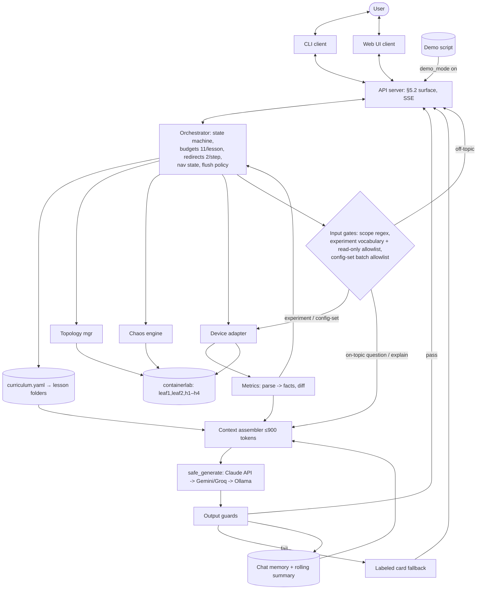

# SONiC ChaosLab

> Learn networking by breaking it.

An interactive, AI-assisted CLI that teaches how SONiC behaves under failure. It explains a
concept on a live virtual SONiC lab, injects **one** controlled failure, shows the **real**
before/after state, and has an LLM explain the observed impact in plain language — then a
one-click reset restores the lab. Explanations are grounded in **actual observed device state**,
never textbook recall: code computes the facts, the model only explains them.

Works out of the box with **no lab, no Docker, and no API keys** — a mock lab replays canned
`sonic-vs` output and a deterministic fake model drives the loop.

---

## What existed before vs what was built during the hackathon

| Pre-existing (open source, reused) | Built during the hackathon (this repo) |
|---|---|
| **Containerlab** — declarative container labs | **Engine** — orchestrator state machine, budgets, guardrails, flush policy |
| **`docker-sonic-vs`** — virtual SONiC switch | **Lessons-as-data** — schema, loader, and the mechanical MD→YAML converter |
| **FRR** — routing stack (BGP) inside SONiC | **Chaos integration** — inject/restore of authored command lists, diff-on-observed-state |
| **Pumba / `tc` / `iptables`** — chaos primitives | **Grounded LLM stack** — fixed-shape context, deterministic guards, provider chain + fake |
| **LLM APIs** (Anthropic / Gemini / Groq / Ollama) | **API surface** (§5.2) + thin CLI, mock adapter, fixtures, golden harness |

The novel work is the SONiC-specific integration, the lesson content pipeline, and the
explain-on-observed-state engine.

---

## Quickstart A — no lab, no keys

```bash
make setup     # venv + deps + .env + convert & validate lessons
make run       # guided lesson loop on the mock lab + fake model
```

`make run` opens the interactive shell (`SonicChaosLab>`). Type `lessons` for the catalogue, then
walk a lesson: teach → observe (grounded baseline explanation) → Q&A → break something →
before/after diff + grounded impact explanation → restore. No containerlab, no keys required.

## Quickstart B — full lab (x86 host)

Requires an **x86 Linux host** with Docker (sonic-vs is amd64-only; ~8 GB RAM). See
[topo/README.md](topo/README.md).

```bash
make lab-bootstrap                       # one-time: install containerlab + fetch the sonic-vs image
make lab-up                              # containerlab deploy + poll until leafs answer
chaoslab settings set lab_mode local     # talk to the real lab
chaoslab settings set provider anthropic # optional: real explanations (needs ANTHROPIC_API_KEY)
chaoslab lesson bgp_reconvergence        # run the flagship lesson live
make lab-down                            # tear the lab down
```

---

## Architecture



All shell/docker access is confined to `lab/adapter.py` and `lab/topology.py`. The CLI and API are
thin clients over one orchestrator; the model never counts, gates flow, or executes anything.

Source layout:

```
src/chaoslab/
  cli.py              # typer + rich + questionary CLI (thin client)
  settings.py         # persisted config (never secrets) + env-only API keys
  core/               # orchestrator, engine, demo store, shared models
  lab/                # adapter (mock/docker), metrics, chaos, topology  <- all shell access
  llm/                # model chain + fake, context assembler, guardrails
  lessons/            # schema, loader, models
  api/                # FastAPI §5.2 surface
lessons/              # authored curriculum (MD) + generated YAML per lesson
topo/                 # containerlab file + baseline configs
scripts/              # convert_lessons, gen_mock_fixtures, gen_demo_answers, run_golden
tests/                # pytest + fixtures + golden set
ui/                   # placeholder — see note below
```

---

## CLI reference (§5)

| Command | Effect |
|---|---|
| `chaoslab --help` | Full command reference |
| `chaoslab up` / `chaoslab down` | Deploy / destroy the containerlab topology |
| `chaoslab shell` | Interactive `SonicChaosLab>` prompt accepting every command (prefix optional) |
| `chaoslab lessons` | Lesson catalogue → guided loop (arrow-key menus; Back returns here) |
| `chaoslab lesson <id>` | Jump straight into one lesson |
| `chaoslab run -cmd "<command\|instruction>"` | Free experiment mode: safety-gated read-only command on the lab (raw output) |
| `chaoslab settings [list\|get k\|set k v]` | App settings (provider, model, lab_mode, max_questions, demo_mode, …) |
| `chaoslab config get <node>` | Dump the node's running config (CONFIG_DB view) |
| `chaoslab config set <node> "<line>" ...` | Apply SONiC `config` set-family lines (allowlisted, atomic, confirmed) |
| `chaoslab topology` | Diagram + per-node IPs/MACs/ASNs + links; live mgmt IPs & link state when the lab is up |
| `chaoslab status` | One-shot health: provider reachable? lab deployed? nodes ready? |
| `chaoslab reset` | Restore the lab baseline (re-apply bound configs + startup ports; clears session state) |
| `chaoslab transcript` | Export the current/last session transcript |
| `chaoslab version` | Version info |

In-session keys: arrow-key menus everywhere; `↑ Lesson menu` goes up one level (step → lesson menu
→ catalogue) and `← Previous step` steps back sequentially; `Continue` advances; `Quit` saves
progress and exits (resume with `chaoslab lessons`).

---

## Makefile targets

| Target | What it does |
|---|---|
| `make setup` | venv + `pip install -e ".[dev]"` + copy `.env` + convert & validate lessons |
| `make run` | `chaoslab shell` — interactive prompt (mock + fake out of the box) |
| `make api` | uvicorn dev server for the §5.2 API |
| `make test` | pytest — passes with no network, no lab, no keys |
| `make golden` | run the golden-set harness on the fake provider |
| `make lint` / `make format` | ruff check / ruff format |
| `make build` | `python -m build` → wheel + sdist |
| `make convert-lessons` | regenerate `lessons/<id>/` YAML from `lessons/<id>.md` |
| `make lab-bootstrap` | one-time host setup: install containerlab + fetch the sonic-vs image |
| `make lab-up` / `make lab-down` / `make lab-status` | containerlab lifecycle (graceful if absent) |
| `make lab-reset` | restore the lab baseline (`chaoslab reset`) |
| `make demo-answers` | generate `demo_script.yaml` via the configured provider |
| `make clean` / `make clean-all` | remove artifacts / also remove the venv |
| `make all` | setup + lint + test + build |

Run `make help` to list every target.

---

## Lesson authoring guide

Lessons are **data, not code** — adding lesson N+1 costs content, not engineering.

1. Write `lessons/<id>.md` following the section contract (Meta, Step Plan, Teach Sections,
   Commands, Chaos Options, Observe, Knowledge Card, QnA, and a closing `## Machine Summary` JSON
   block that drives structure).
2. `make convert-lessons` mechanically emits `lessons/<id>/{lesson.yaml, card.yaml, teach.md}`,
   regenerates `lessons/curriculum.yaml`, writes `lessons/schema.yaml`, and validates everything
   against the schema (§9) plus the cross-file rules. Conversion never paraphrases content.
3. Add the lesson to the order in `scripts/convert_lessons.py` (`LESSON_ORDER`).
4. Pre-test each chaos option on `sonic-vs`; ship unverified options as `enabled: false` (they show
   greyed-out in the chaos menu). Fill the knowledge card from verified output only.

The knowledge card does triple duty: it grounds explanations, defines the scope fence, and supplies
the redirect line.

---

## Settings & providers

Settings persist to `~/.chaoslab/settings.json` (**never** secrets). API keys are read from the
environment only (`.env` is git-ignored; copy from `.env.example`).

- `provider`: `fake` (default) · `anthropic` · `gemini` · `groq` · `ollama`. `safe_generate`
  tries the primary, fails over through configured fallbacks, and falls back to a labelled card
  answer if all fail.
- `lab_mode`: `mock` (default, fixtures) · `local` (docker exec) · `ssh` (docker over SSH).
- `max_questions` (11; `demo_mode` forces 3), `redirects_per_step` (2), temperatures.

Keys by provider: `ANTHROPIC_API_KEY`, `GEMINI_API_KEY`, `GROQ_API_KEY` (Ollama needs only a host).

---

## Testing

```bash
make test     # full suite: parsers, guards, orchestrator, loader, converter, CLI, API, golden
make golden   # scope-gate / routing eval on the fake provider
```

The suite runs with **no network, no lab, and no API keys**: the mock adapter serves fixtures and
the fake model is deterministic.

---

## Web UI

`ui/` is an intentional **placeholder** (only `.gitkeep`). The web UI has no design yet and is owned
by a teammate; it will consume the §5.2 HTTP API (`make api`). No UI code lives in this repo.

---

## Known limitations & roadmap (§11)

1. **No live re-query** — the model sees snapshots, not "what's the state now?" → roadmap: a
   read-only `get_current_state` tool call.
2. **No eval harness beyond routing** — `run_golden` checks the scope gate/pipeline structurally →
   roadmap: a 20-question golden set with graded answer quality.
3. **Regex/substring scope gate is brittle** → roadmap: an embedding-based gate.
4. **Static cards cap Q&A depth** — real RAG only worthwhile at ≥10 lessons.
5. **No learner modeling/adaptivity** — same content for everyone.
6. Subtly-wrong-but-plausible explanations can pass deterministic checks (mitigated by cards + low
   temperature + a strong model; solved properly by an eval set).

---

## Dependencies & licenses

Runtime (Python): typer (MIT), rich (MIT), questionary (MIT), pydantic (MIT), PyYAML (MIT),
jsonschema (MIT), FastAPI (MIT), uvicorn (BSD-3-Clause), sse-starlette (BSD-3-Clause), httpx
(BSD-3-Clause), anthropic (MIT), python-dotenv (BSD-3-Clause). Dev: pytest (MIT), pytest-asyncio
(Apache-2.0), ruff (MIT), build (MIT).

Lab (pre-existing OSS, not vendored): Containerlab (BSD-3-Clause), `docker-sonic-vs` / SONiC
(Apache-2.0), FRR (GPL-2.0-or-later), Alpine (base image).

---

## License

Apache-2.0. Every source file carries an SPDX header. See [LICENSE](LICENSE). Product spec:
[PRODUCT.md](PRODUCT.md); design decisions: [docs/DECISIONS.md](docs/DECISIONS.md).
